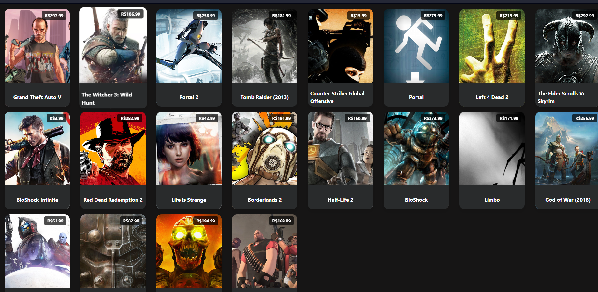

# 🚀 Projeto de integração com meios de pagamento usando Laravel & React

Este é um projeto desenvolvido utilizando Laravel e React, rodando dentro de containers Docker.

## 🧰 Pré-requisitos

Para rodar este projeto, você precisa ter instalado na sua máquina:

- [Docker](https://www.docker.com/get-started)
- [Composer](https://getcomposer.org/download/)
- [npm](https://www.npmjs.com/get-npm)
- [make](https://www.gnu.org/software/make/)
- [git](https://git-scm.com/downloads)

## 🛠️ Tecnologias Utilizadas

Este projeto foi desenvolvido com as seguintes tecnologias:

- [Laravel](https://laravel.com/)
- [PHP](https://www.php.net/)
- [React](https://reactjs.org/)

## 💻 Executando o projeto


### 1️⃣ Clone o repositório
```
ssh: git clone git@github.com:Lincolnbiancard/asaas-payment-integration.git
```
Ou
```
Http: git clone https://github.com/Lincolnbiancard/asaas-payment-integration.git
```
```
cd asaas-payment-integration
```

### 2️⃣ Copie o arquivo .env
```bash
cp .env.example .env && composer install
```

### 3️⃣ Construa e inicialize o ambiente Docker
```
make up
```

### 4️⃣ Instale as dependências do backend
```
make composer-install
```

### 5️⃣ Execute as migrações do Laravel
```
make migrate
```

### 6️⃣ Instale as dependências do frontend e inicie o servidor de desenvolvimento
```bash
cd front
```
```bash
npm install
```
```bash
npm start
```

###  Inicie a aplicação
Agora, o frontend React deve estar rodando em http://localhost:3000.

### Você deve ver uma tela parecida com está:


🎉 Parabéns! Agora você deve ter seu projeto Laravel & React rodando em seu ambiente local!

#
## 🧪 Testes

Este projeto usa a ferramenta PHPUnit para testes de unidade. Para rodar os testes, execute:
```
make test
```

#

## 💡 Cobertura de Testes

A cobertura de testes é uma medida importante para garantir a qualidade do código. Nosso objetivo é sempre manter a cobertura de testes tão alta quanto possível. 

Para gerar um relatório de cobertura de testes, você pode usar o seguinte comando:
```bash
make coverage
```
Os relatórios gerados vão estar disponíveis na pasta `coverage` na raiz do projeto.


